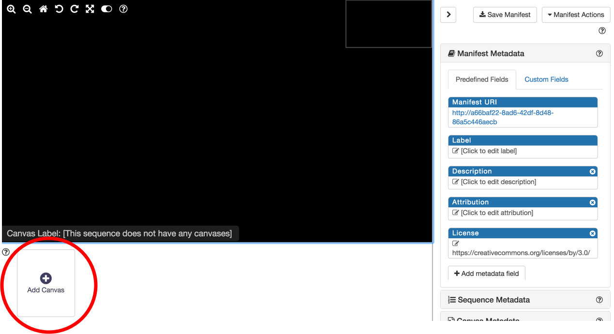
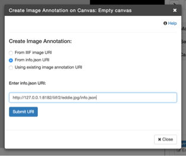
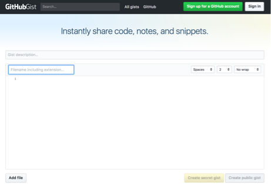
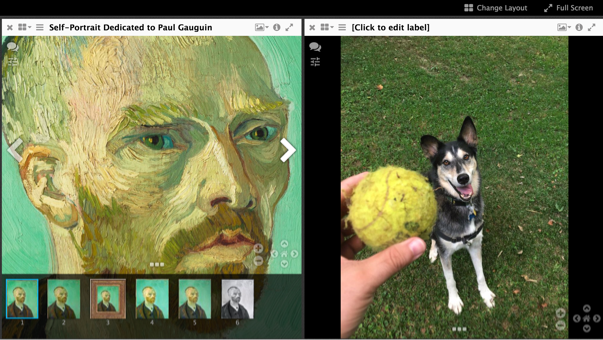

# Creando un manifest de IIIF

Antes dijimos que los manifests de IIIF usando la API de Presentación pueden ser muy complejos y soportar una amplia variedad de opciones. Ahora vamos a crear un manifest. En la práctica, la creación de manifests tiene lugar de varias maneras.

 - Interpretado automáticamente de metadatos de objeto imagen
 - Creado por expertos para investigación e interpretación
 - Una mezcla de los anteriores

## Construyendo el manifest
Para este ejercicio, vamos a crear un manifest usando una herramienta en línea.

Para empezar navegue a:

http://iiif.bodleian.ox.ac.uk/manifest-editor/

Esta es una versión demo/alojada del [iiif-manifest-editor](https://github.com/bodleian/iiif-manifest-editor).

1. Clic en "New Manifest"

1. Clic en "Add Canvas" y entonces clic en "Empty Canvas"

  

1. Ahora necesitamos añadir una imagen a este canvas. Clic en "Add Image to Canvas"

1. Y queremos usar una imagen que ya estamos alojando, así que seleccionamos la opción "From info.json URI", e introducimos nuestra URI de info.json de nuestro servidor de IIIF local. Entonces clic en "Submit URI"

  `http://127.0.0.1:8182/iiif/2/eddie.jpg/info.json`

  

1. ¡Ahora debiéramos ver una imagen!

1. Finalmente, vamos a descargar el manifest, con un clic en "Save Manifest" en la parte superior de la página, y clic en "Save"

  ¡Buen trabajo! Ya ha creado y descargado un manifest de la API de Presentación de IIIF. Pero espere, ¡hay más!

## Visualizando en nuevos entornos

### Alojando el manifest
Veamos esto en algunos entornos distintos. Primero necesitamos alojarlo.

1. Navegue a https://gist.github.com

1. Arrastre y suelte su archivo `manifest.json` en la ventana y clic en "Create Secret Gist" (o público si prefiere, no importa).

  

1. Después de creado el gist, clic en el botón "Raw" para obtener la url del archivo raw.

### Visualizando en UniversalViewer
1. Copie esa URL, navegue a [http://universalviewer.io/uv.html?manifest=](http://universalviewer.io/uv.html?manifest=) y pegue la url del manifest alojado después del `=` en la url.

  Debiera ver sus imágenes en el [UniversalViewer](http://universalviewer.io/).

### Visualizando en Mirador
Veamos esto también en [Mirador](projectmirador.org)

1. Navegue a [http://projectmirador.org/demo/](http://projectmirador.org/demo/).

1. Clic en la `x` en ambas ventanas para cerrar las ventanas.

1. Mueva el cursor sobre el ícono a la derecha de la `x` y clic en "Replace Object"

  

1. Pegue su url de manifest en el recuadro de texto "Add new object from URL:"

1. Clic en "Load" - Debiera ver su manifest cargado. Clic en una de sus imágenes. 

Ahora debiera ver una de sus imágenes junto a un van Gogh

** Crédito Extra **

Puede haber notado labels como "Click to edit label" en los entornos de visualización. Esto se debe a que no los editamos en el editor de manifests. Regrese y repita el ejercicio, editando labels y agregando nuevas imágenes.
