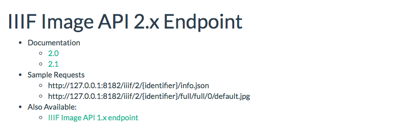
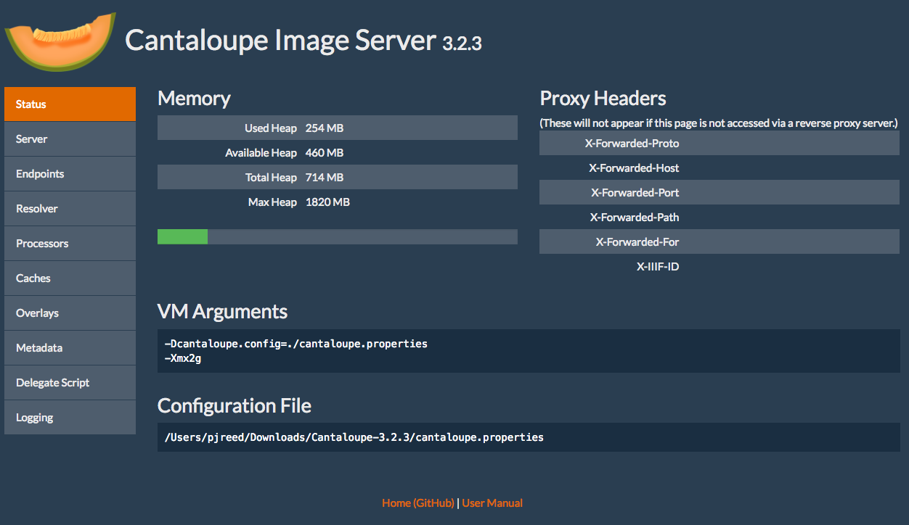

# Instalando el servidor de imágenes de IIIF Cantaloupe

Compruebe que tiene [instalados los prerrequisitos](PREREQUISITES.md#iiif-server-requirements).

## Descargar Cantaloupe

Para más información, vea [guía de inicio de Cantaloupe](https://medusa-project.github.io/cantaloupe/get-started.html).

Descargue [Cantaloupe v3.3.1](https://github.com/medusa-project/cantaloupe/releases/download/v3.3.1/Cantaloupe-3.3.1.zip)

Abra y extraiga el archivo zip en un directorio de su elección. Sugerimos `~/Desktop`.

Ahora cambie el directorio a ese directorio extraído

```sh
$ cd ~/Desktop/Cantaloupe-3.3.1
```

## Configurar Cantaloupe

Ahora vamos a crear una copia del archivo de configuración:

```sh
$ cp cantaloupe.properties.sample cantaloupe.properties
```

Ahora vamos a activar el panel admin donde modificaremos las restantes opciones.

Desplácese a la línea 34, y cambie `false` por `true`. También, añada una contraseña.

```diff
# Activa el Panel de Control, en /admin.
- admin.enabled = false
+ admin.enabled = true
# Contraseña para acceder al Panel de Control. (El nombre de usuario es siempre "admin".)
- admin.password =
+ admin.password = yolo
```

Guarde el archivo.

Ahora vamos a tratar de iniciar el servidor. Ejecute este comando desde su directorio de Cantaloupe

```sh
$ java -Dcantaloupe.config=./cantaloupe.properties -Xmx2g -jar Cantaloupe-3.3.1.war
```

Ahora navegue a [http://127.0.0.1:8182/iiif/2](http://127.0.0.1:8182/iiif/2) en su navegador.

Debiera ver esto:



¡Felicitaciones, ha instalado Cantaloupe exitosamente!

También, compruebe que puede entrar al panel admin navegando a [http://127.0.0.1:8182/admin](http://127.0.0.1:8182/admin).

Use el nombre de usuario `admin` y la contraseña que haya especificado anteriormente.


