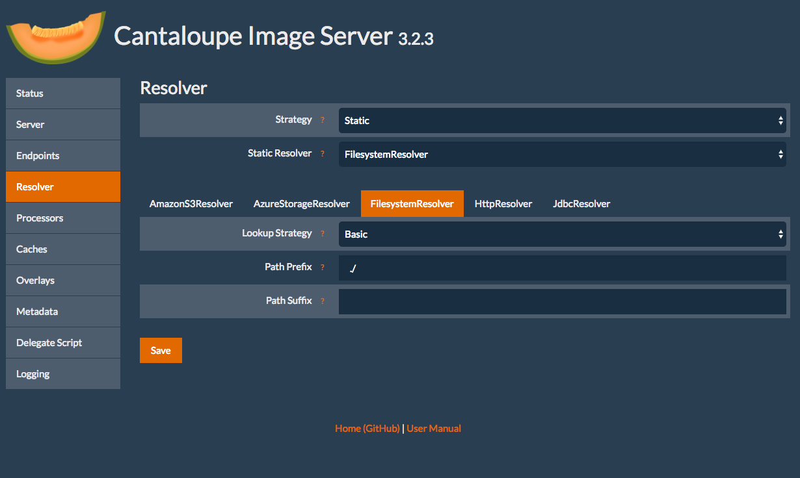
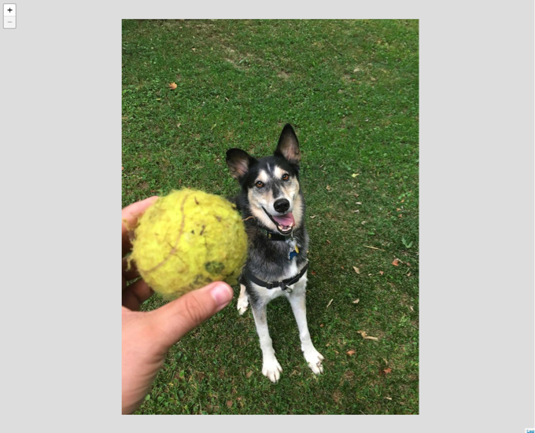

# Apuntando su servidor de imágenes a algunas imágenes

¡Felicitaciones, ahora tiene su servidor de imágenes en ejecución! ¡Necesitamos entregarle algunas imágenes para que sea feliz!

## Descargar algunas imágenes

Descargue una imagen `*.jpg` de la Internet a su directorio de Cantaloupe `Cantaloupe-3.3.1`. Aquí tiene una [eddie.jpg](https://github.com/sul-cidr/histonets/raw/master/spec/fixtures/images/eddie.jpg) que puede usar.

## Configurar Cantaloupe para que use la ruta correcta

Ahora necesitamos configurar Cantaloupe para que use ese directorio de imágenes.

Navegue a la página admin [http://127.0.0.1:8182/admin](http://127.0.0.1:8182/admin).

Clic en "Resolver", y entonces clic en la pestaña "FilesystemResolver".

Seguidamente llene Path Prefix como `./`

## Ver en el navegador

Ahora debiera poder navegar exitosamente a la respuesta info.json de una imagen.

Vea [http://127.0.0.1:8182/iiif/2/eddie.jpg/info.json](http://127.0.0.1:8182/iiif/2/eddie.jpg/info.json)

Y si todo sale bien, debiera ver una respuesta `info.json`.

Finalmente, veámosla usando el visor Leaflet-IIIF de la api de imagen.

Pruebe esta url: [http://mejackreed.github.io/Leaflet-IIIF/examples/?url=http://127.0.0.1:8182/iiif/2/eddie.jpg/info.json](http://mejackreed.github.io/Leaflet-IIIF/examples/?url=http://127.0.0.1:8182/iiif/2/eddie.jpg/info.json)

Note como añadimos la respuesta info.json de nuestro servidor de IIIF local como un parámetro. Los clientes de la API de Imagen de IIIF usan esto para comprender como pueden solicitar imágenes/mosaicos.

Dedos cruzados, pero debiera ver una foto de Eddie en un visor zoomable.
