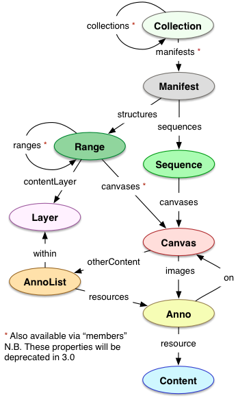

# Especificaciones de IIIF

Las especificaciones técnicas de IIIF son el pegamento que sostiene la interoperabilidad de imágenes.

[Lista completa de especificaciones](http://iiif.io/api/#current-specifications)

IIIF proporciona dos APIs principales:
 - API de Imagen (Quiero píxeles de imágenes)
 - API de Presentación (Quiero mostrar las imágenes)
 
IIIF soporta otras APIs que incluyen Búsqueda y Autenticación. Este taller se concentra en las APIs de Imagen y Presentación.

## [API de Imagen](http://iiif.io/api/image/2.1/)

La API de Imagen posibilita una manera estandarizada de solicitar y entregar imágenes. Esto puede ser tan simple como, dame la imagen original, o tan complejo como dame una versión girada 180º y en mosaicos de la imagen en formato gif. La API de Imagen de IIIF es restful y permite servir las imágenes dinámicamente o desde una caché estática (detalles de implementación).

Las imágenes son solicitadas usando plantillas de URI que tienen la siguiente sintaxis:

```
{scheme}://{server}{/prefix}/{identifier}/{region}/{size}/{rotation}/{quality}.{format}
``` 

El siguiente es un ejemplo de como la modificación de estos parámetros puede cambiar la imagen que se entrega.

[](http://iiif.io/api/image/2.1/#order-of-implementation)[^1]
```
region=125,15,120,140 size=90, rotation=!345 quality=gray
.../125,15,120,140/90,/!345/gray.jpg
# Source: http://iiif.io/api/image/2.1/#order-of-implementation
```

Profundizaremos en esto más adelante con una demostración práctica de como funciona.

## [API de Presentación](http://iiif.io/api/presentation/2.1/)

La API de Presentación de IIIF permite proporcionar metadatos sobre la estructura y layout de los objetos imagen. Los objetos de tipo imagen representan cosas como:
 - imágenes individuales
 - grupos de imágenes ordenadas
 - grupos de imágenes que representan páginas (libro, manuscrito)
 
La API de Presentación proporciona metadatos sobre como pueden ser mostrados estos objetos imagen.

### Objetos básicos
[](http://iiif.io/api/presentation/2.1/#basic-types)[^2]

### Objetos más complejos
[](http://iiif.io/api/presentation/2.1/#additional-types)[^3]

[^1]: http://iiif.io/api/image/2.1/#order-of-implementation
[^2]: http://iiif.io/api/presentation/2.1/#basic-types
[^3]: http://iiif.io/api/presentation/2.1/#additional-types

Algún contenido fue adoptado de [Todo lo que siempre quiso saber sobre IIIF pero temía preguntar](https://www.slideshare.net/Cogapp/everything-you-ever-wanted-to-know-about-iiif-but-were-too-afraid-to-ask).
